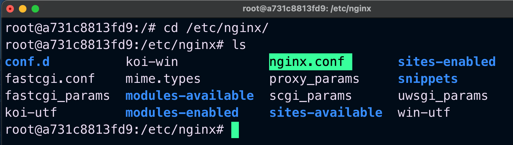
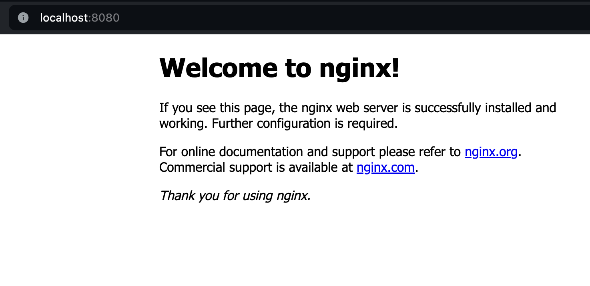

spin off ubuntu container<br>
```$ docker run -it -p 8080:80 ubuntu```

in ubuntu terminal:<br>
```audo apt-get install```<br>
```sudo apt-get install nginx```

The following is the file structure after installation.


After executing following command 
```$ nginx``` 

On localhost, Nginx displays the default page, which typically executes on port 80. However, since I have mapped port 8080 to port 80, it now appears on port 8080.


 


