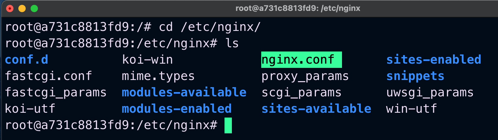

Nginx is a high-performance web server and reverse proxy server used for serving web content, load balancing, and handling large amounts of traffic efficiently.
It is widely used for serving static content, load balancing, and handling HTTP requests efficiently. Its lightweight architecture makes it ideal for modern web applications and microservices.
spin off ubuntu container<br>
```$ docker run -it -p 8080:80 ubuntu```

in ubuntu terminal:<br>
```audo apt-get install```<br>
```sudo apt-get install nginx```

The following is the file structure after installation.


After executing following command 
```$ nginx``` 

On localhost, Nginx displays the default page, which typically executes on port 80. However, since I have mapped port 8080 to port 80, it now appears on port 8080.<br>


Basic nginx.conf<br>


Reload Nginx server by using following command<br>
```nginx -s reload```

-s reload sends a signal to instruct nginx to reload its configuration file without actually stopping and starting the process.


Serve static content:
I added an HTML index file to the mysite directory. Now the Nginx configuration looks like this:

```
events {

}

http {
    server {
        listen 80;
        server_name _;
        root /etc/nginx/mysite/;
    }
}
```


<p>Home Page</p>


<p>
<b>forward request to proxy server:<br></b>
 proxy_pass "http://X.X.X.X:PORT$request_uri";

</p>
NGINX WEBSEVER
